# GitHub Webhook Continuous Deployment Guide
## Complete Setup for IIS App Pool Recycler

This guide will walk you through setting up automated deployment from GitHub to your IIS server using webhooks and Kudu.

## 🚀 Quick Start

Run this single PowerShell command on your IIS server as Administrator:

```powershell
# Download and run the complete setup script
iex ((New-Object System.Net.WebClient).DownloadString('https://raw.githubusercontent.com/Agile-Works/IISAppPoolRecycler/main/setup-continuous-deployment.ps1'))
```

**OR** follow the manual steps below:

---

## 📋 Prerequisites

✅ **Your IIS Server Requirements:**
- [ ] Windows Server with IIS installed and running
- [ ] .NET 6.0 Runtime installed
- [ ] Git installed and accessible from command line
- [ ] PHP installed (optional - PowerShell alternative provided)
- [ ] Administrator privileges
- [ ] Public IP address or domain name (for GitHub webhooks)
- [ ] Port 80/443 accessible from the internet

✅ **Network Requirements:**
- [ ] Firewall allows inbound HTTP/HTTPS traffic
- [ ] Router/NAT configured to forward traffic to your server
- [ ] GitHub can reach your server (test with `curl` from external network)

---

## 🛠️ Manual Setup Steps

### Step 1: Clone the Repository

```cmd
# On your IIS server, run as Administrator
cd C:\
git clone https://github.com/Agile-Works/IISAppPoolRecycler.git
cd IISAppPoolRecycler
```

### Step 2: Run the Setup Script

```powershell
# Run the enhanced setup script
.\setup-continuous-deployment.ps1
```

**What the script does:**
- ✅ Checks all prerequisites
- ✅ Creates webhook infrastructure
- ✅ Downloads webhook receiver files
- ✅ Configures IIS applications
- ✅ Sets up secure configuration
- ✅ Generates webhook secret
- ✅ Creates monitoring scripts

### Step 3: Configure GitHub Webhook

1. **Go to your repository**: https://github.com/Agile-Works/IISAppPoolRecycler

2. **Navigate to Settings → Webhooks**

3. **Click "Add webhook"**

4. **Configure the webhook:**
   ```
   Payload URL: http://YOUR-SERVER-IP/github-webhook/webhook-receiver.php
   Content type: application/json
   Secret: [Use the secret generated by setup script]
   Events: Just the push event
   Active: ✅ Checked
   ```

5. **Save the webhook**

---

## 🧪 Testing Your Setup

### Test 1: Manual Deployment

```cmd
# On your server, test manual deployment
cd C:\kudu-webhooks
.\deploy-webhook.bat
```

### Test 2: Webhook Endpoint Health

```bash
# From any machine, test webhook endpoint
curl http://YOUR-SERVER-IP/github-webhook/webhook-receiver.php?health
```

Expected response:
```json
{
  "status": "healthy",
  "service": "GitHub Webhook Receiver",
  "version": "2.0.0",
  "timestamp": "2025-01-14T10:30:00+00:00",
  "server_info": {
    "php_version": "8.x.x",
    "deployment_script": "available",
    "config_file": "available",
    "last_deployment": "never"
  }
}
```

### Test 3: GitHub Webhook Delivery

1. **Make a small commit** to your repository:
   ```bash
   # Add a comment or small change
   echo "# Test deployment" >> README.md
   git add README.md
   git commit -m "Test webhook deployment"
   git push
   ```

2. **Check webhook delivery** in GitHub:
   - Go to Settings → Webhooks
   - Click on your webhook
   - Check "Recent Deliveries" tab
   - Should show successful delivery (200 response)

### Test 4: Verify Application Deployment

```bash
# Test the deployed application
curl http://YOUR-SERVER-IP/IISRecycler/api/webhook/sites
curl http://YOUR-SERVER-IP/IISRecycler/swagger
```

---

## 📊 Monitoring Your Deployment Pipeline

### Deployment Logs

```powershell
# View recent deployments
Get-Content C:\kudu-webhooks\webhook-deployment.log -Tail 20

# View webhook activity
Get-Content C:\kudu-webhooks\webhook.log -Tail 20

# Monitor deployments in real-time
Get-Content C:\kudu-webhooks\webhook-deployment.log -Wait
```

### Application Status

```powershell
# Check IIS application pools
Get-IISAppPool | Where-Object Name -eq "DefaultAppPool" | Select-Object Name, State

# Check IIS applications
Get-IISServerManager | Get-IISSite -Name "Default Web Site" | Get-IISApplication

# Test application endpoints
Invoke-WebRequest http://localhost/IISRecycler/api/webhook/sites
```

### GitHub Webhook Status

1. **View webhook deliveries**: https://github.com/Agile-Works/IISAppPoolRecycler/settings/hooks
2. **Check delivery logs** for each webhook event
3. **Monitor response codes** (200 = success, 500 = server error, etc.)

---

## 🔧 Configuration Files

### Main Configuration: `C:\kudu-webhooks\config.ini`

```ini
[webhook]
secret=YOUR_GENERATED_SECRET
repository=Agile-Works/IISAppPoolRecycler
deployment_path=C:\inetpub\wwwroot\IISRecycler
branch=main
app_pool_name=DefaultAppPool

[logging]
enabled=true
log_file=webhook-deployment.log
debug_mode=false

[deployment]
backup_before_deploy=true
restart_app_pool=true
test_endpoint=http://localhost/IISRecycler/api/webhook/sites
```

### IIS Configuration

The setup creates these IIS applications:
- **`/github-webhook`** → `C:\kudu-webhooks` (webhook receiver)
- **`/IISRecycler`** → `C:\inetpub\wwwroot\IISRecycler` (main application)

---

## ⚡ Workflow Overview



```mermaid
graph LR
    A[Developer Push] --> B[GitHub Repository]
    B --> C[GitHub Webhook]
    C --> D[IIS Server webhook-receiver.php]
    D --> E[deploy-webhook.bat]
    E --> F[Git Clone Latest Code]
    F --> G[Kudu deploy.cmd]
    G --> H[.NET Build & Publish]
    H --> I[Deploy to IIS]
    I --> J[Restart App Pool]
    J --> K[Application Updated]
```

### What Happens on Each Push:

1. **GitHub receives your push** → triggers webhook
2. **Webhook receiver validates** → signature, repository, branch
3. **Deployment script runs** → clones latest code
4. **Kudu deployment executes** → builds and publishes .NET application
5. **IIS application updates** → new version goes live
6. **App pool recycles** → ensures clean restart
7. **Logs everything** → for monitoring and debugging

---

## 🛡️ Security Considerations

### Webhook Security
- ✅ **Signature validation** prevents unauthorized deployments
- ✅ **Repository validation** ensures only your repo can trigger deployment
- ✅ **Branch validation** only deploys from specified branch (main)
- ✅ **Secure secret generation** using cryptographically secure random

### IIS Security
- ✅ **Dedicated app pool** isolates the application
- ✅ **Limited permissions** application runs with minimal required privileges
- ✅ **HTTPS recommendation** use SSL certificates in production

### Network Security
- ⚠️ **Firewall configuration** ensure only necessary ports are open
- ⚠️ **IP restrictions** consider limiting webhook access to GitHub IP ranges
- ⚠️ **VPN/Private network** for additional security in enterprise environments

---

## 🔍 Troubleshooting

### Common Issues

#### 1. Webhook Not Triggering
```bash
# Check GitHub webhook deliveries
# Verify server is accessible from internet
curl -I http://YOUR-SERVER-IP/github-webhook/webhook-receiver.php

# Check firewall
netstat -an | findstr :80
```

#### 2. Deployment Fails
```powershell
# Check deployment logs
Get-Content C:\kudu-webhooks\webhook-deployment.log -Tail 50

# Verify Git access
git --version
git clone https://github.com/Agile-Works/IISAppPoolRecycler.git test-clone

# Check .NET installation
dotnet --version
```

#### 3. Application Not Starting
```powershell
# Check IIS application pool status
Get-IISAppPool -Name "DefaultAppPool"

# Check application logs
Get-Content C:\inetpub\wwwroot\IISRecycler\logs\stdout*.log -Tail 20

# Verify deployment files
dir C:\inetpub\wwwroot\IISRecycler
```

#### 4. Webhook Returns 500 Error
```bash
# Test webhook manually
curl -X POST http://YOUR-SERVER-IP/github-webhook/webhook-receiver.php \
     -H "Content-Type: application/json" \
     -d '{"test": "data"}'

# Check PHP configuration
php --version
php -m | findstr curl
```

### Debug Commands

```powershell
# Full system health check
.\setup-continuous-deployment.ps1 -Verbose

# Test individual components
php -f C:\kudu-webhooks\webhook-receiver.php
cmd /c C:\kudu-webhooks\deploy-webhook.bat

# IIS diagnostics
Get-IISSite
Get-IISApplication
Get-IISAppPool
```

---

## 📈 Performance Optimization

### Deployment Speed
- **Shallow clone** (already configured) reduces download time
- **Single branch** clone improves performance
- **Incremental builds** Kudu only rebuilds changed files
- **Parallel processing** where possible

### Monitoring
- Set up **application performance monitoring**
- Configure **deployment notifications** (email/Slack)
- Implement **health checks** for the deployed application
- Monitor **disk space** for log files and artifacts

---

## 🚀 Advanced Configuration

### Custom Deployment Triggers

You can extend the webhook receiver to support:
- **Branch-specific deployments** (dev, staging, production)
- **Tag-based deployments** (only deploy on version tags)
- **Pull request testing** (deploy PR branches to test environments)

### Integration with Other Services

- **Slack notifications** on deployment success/failure
- **Email alerts** for deployment status
- **Database migrations** as part of deployment
- **Smoke tests** after deployment

### Backup and Rollback

```powershell
# Configure automatic backups before deployment
# Add to config.ini:
[deployment]
backup_before_deploy=true
backup_retention_days=7
```

---

## ✅ Deployment Checklist

### Pre-Production
- [ ] Test webhook delivery from GitHub
- [ ] Verify manual deployment works
- [ ] Check all application endpoints
- [ ] Confirm app pool recycling works
- [ ] Test with sample commit
- [ ] Verify logging is working
- [ ] Check security configurations

### Production Deployment
- [ ] Configure HTTPS/SSL certificates
- [ ] Set up monitoring and alerting
- [ ] Configure backup procedures
- [ ] Document rollback procedures
- [ ] Test disaster recovery
- [ ] Set up performance monitoring
- [ ] Configure log rotation

### Post-Deployment
- [ ] Monitor first few deployments closely
- [ ] Verify application performance
- [ ] Check log files for errors
- [ ] Test Uptime Kuma integration
- [ ] Document any issues found
- [ ] Update team documentation

---

## 🆘 Support and Resources

### Logs Location
- **Webhook logs**: `C:\kudu-webhooks\webhook.log`
- **Deployment logs**: `C:\kudu-webhooks\webhook-deployment.log`
- **Application logs**: `C:\inetpub\wwwroot\IISRecycler\logs\`
- **IIS logs**: `C:\inetpub\logs\LogFiles\`

### GitHub Resources
- **Repository**: https://github.com/Agile-Works/IISAppPoolRecycler
- **Issues**: https://github.com/Agile-Works/IISAppPoolRecycler/issues
- **Wiki**: https://github.com/Agile-Works/IISAppPoolRecycler/wiki

### Documentation Files
- `README.md` - Main project documentation
- `DEPLOY-TO-IIS.md` - IIS deployment guide
- `KUDU-DEPLOYMENT.md` - Kudu-specific deployment
- `DEPLOYMENT.md` - General deployment guide

---

🎉 **Congratulations!** Your GitHub to IIS continuous deployment pipeline is now ready!

Every time you push code to your repository, it will automatically deploy to your IIS server. Monitor the logs and GitHub webhook deliveries to ensure everything is working smoothly.
